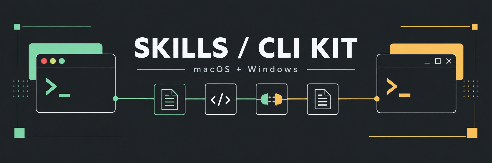
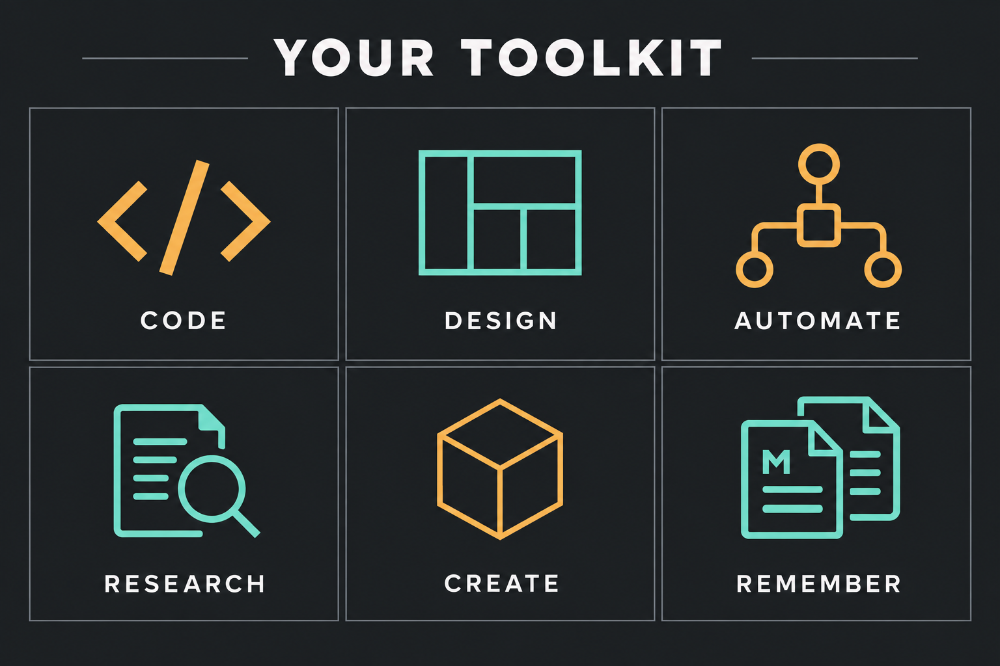

# Skills and CLI setup kit



Private, versioned setup for **macOS and Windows**: both skill libraries, GSD,
boot rules, shared vault workflow, hooks, status line, plugins and MCP runtimes.

- **171 Claude skills and 233 Codex skills**, including the 54 previously missing plugin mirrors.
- Pinned GSD, ECC, Ponytail, Context Mode and HyperFrames sources/runtimes.
- One installer with preview, checked backups, recovery and isolated-profile tests.
- Codex discovers skills on demand, avoiding a large catalog in every prompt.
- Generic Brain template only. Actual Brain notes and credentials stay off GitHub.

Start with [SETUP.md](SETUP.md) for prerequisites, application connections and acceptance checks.

```sh
git clone https://github.com/gabz147/skills.git
cd skills
python3 setup.py          # preview on macOS
python3 setup.py --apply  # install
```

On Windows use `python` in place of `python3`, or `./install.ps1 -Apply`.
Existing installations require reviewed replacement with `--replace`.

[manifest.json](manifest.json) lists every skill, pinned version and packaged-file
checksum. [PORTABILITY.md](PORTABILITY.md) identifies platform-specific recipes.
Codex's internal `.system` skills and app-managed plugins come from the official
client installation. Specialized skills still require their own apps/project data.

Background capture scheduling remains optional and Windows-only; the shared
controller and live checkpoints work on both systems. Native plugin trust and
client logins are completed on each machine.

## Explore the toolkit



Browse the [Claude library](claude), [Codex library](codex), and
[shared Brain workflow](kit/agent-brain). App requirements and platform limits
are listed in [SETUP.md](SETUP.md) and [PORTABILITY.md](PORTABILITY.md).

Validation: `python -m unittest -v test_setup`; `python check_runtime.py` checks an
installed full kit. GitHub Actions runs Windows and macOS setup checks.

[Graphics and generation prompts](docs/graphics/README.md).
