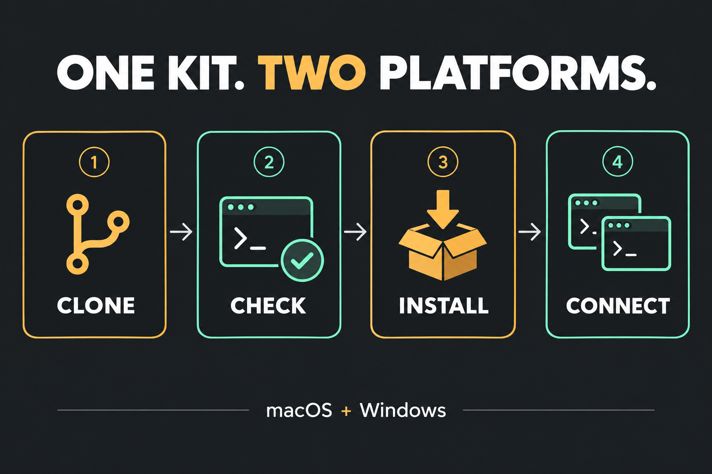

# Full CLI setup: macOS and Windows

This private repository installs the reusable terminal setup. Actual Brain notes,
credentials, conversation history, project assets, approval policies and native
hook trust are not imported from the workstation. Existing destination policies
and unrelated settings are preserved. Both clients use one local Markdown vault.

## Prerequisites

Install Git, Python **3.11+**, Node.js **22.5+** with npm, and both CLIs on PATH.
Windows also needs **Git Bash**, because GSD and Superpowers include Bash hooks.
Use the official [Claude Code installer](https://code.claude.com/docs/en/setup)
and [Codex CLI installer](https://developers.openai.com/codex/cli/).
The kit was developed against Claude Code 2.1.270 and Codex CLI 0.154.0; native
plugin commands must be available. Installing plugins does not require making a
model call. Log into each client separately when starting it.

## Install



Clone while authenticated to the private repository, then preview:

```sh
git clone https://github.com/gabz147/skills.git
cd skills
```

macOS:

```sh
python3 setup.py --doctor
python3 setup.py
python3 setup.py --apply
```

Windows PowerShell:

```powershell
python setup.py --doctor
python setup.py
python setup.py --apply
```

`install.sh` and `install.ps1` are convenience wrappers around this same installer.
They now **preview by default**. Add `--apply` or `-Apply` to write.

If existing package files or settings differ, review them, then repeat with
`--replace`. This backs up every replacement. It preserves unrelated files,
settings, boot text outside the shared rule block, existing vault notes and a
customized vault schema. It does not delete local-only files inside a skill.
Existing copies of the six managed plugins under other marketplace names are
disabled in the merged configuration to prevent duplicate hooks; their caches
remain available for recovery.

Use `--home "/path/to/destination home"` for an isolated installation and
`--vault "/path/to/Brain"` for a different vault location. A custom vault must
be outside the checkout, client directories and kit runtime. Existing vaults
must already have the shared index and contract; incompatible vaults require a
reviewed migration. Never point this installer at a project directory as a vault.
An existing `BRAIN_VAULT_ROOT` in the destination's Claude settings remains the
default unless `--vault` explicitly changes it.

Claude receives the Brain paths through `settings.json.env`. Codex receives them
through `shell_environment_policy.set`. For manual controller commands with a
custom vault, use `--vault "/path/to/Brain"` before the controller subcommand.
The default `~/Documents/Brain` works without persistent environment changes.

## What the full command installs

| Component | Destination / behavior |
|---|---|
| 171 Claude skills, 233 Codex skills | `~/.claude/skills`, `~/.codex/skills`; includes all 54 previously excluded Codex plugin mirrors |
| GSD 1.40.0 | `~/.claude/get-shit-done`, 33 agents, hook scripts; Codex's exported GSD skills reference the same runtime |
| Shared vault workflow | Portable boot rules, controller, three canonical vault skills, live Claude hooks; generic vault template only for a new vault |
| Status line and notifications | Five colored pills when usage data is supplied; native macOS/Windows completion/input notifications |
| Claude plugins | Skill Creator, Frontend Design, Superpowers 6.3.0, Context Mode 1.0.107 |
| Codex plugins | ECC 2.2.1 and Ponytail 4.9.0 |
| Codex MCP | OpenAI developer documentation and Context Mode 1.0.169 with seven enabled output tools |
| HyperFrames | 0.8.36 CLI under `~/.local/share/skills-kit/runtime/hyperframes-runtime` |

Plugin source snapshots are installed through a local `skills-kit` marketplace
using each client's native plugin commands. The stable marketplace and runtimes
live under `~/.local/share/skills-kit`; the original checkout can be moved after
installation. Context Mode and HyperFrames dependencies use checked-in npm
lockfiles. Install scripts are disabled during `npm ci`; the required SQLite
native build is then run explicitly and tested. If a prebuilt SQLite binary is
unavailable, install the platform's native compiler tools and retry the failed
installation. No Windows `node_modules` or virtual environments are copied to Mac.
Both clients receive `HYPERFRAMES_NO_TELEMETRY=1` and
`HYPERFRAMES_NO_UPDATE_CHECK=1` for their tool subprocesses.

ECC's Chrome DevTools MCP entry pins `chrome-devtools-mcp@1.9.0`; npm resolves its
dependencies when that optional server first starts. Chrome must be installed
for browser work. HyperFrames rendering also needs a supported browser and any
media assets required by the project. Its version smoke test does not claim a
successful render on the destination.

GSD update-check scripts are retained but not newly activated by the kit.
Updates remain deliberate. Community GSD hooks retain their upstream per-project
opt-in. The custom status line also writes GSD's temporary context-metrics bridge
when the client supplies a valid session ID and context percentage.

Codex Context Mode remains MCP-only with disposable storage outside Brain. No
Codex session-history hooks or parallel vault index are enabled. Claude retains
its separate upstream Context Mode plugin behavior and version.

## Finish in the applications

Restart both clients, log in, and review/approve their native plugin hook trust
prompts. Trust approvals are never cloned or synthesized. Run:

```sh
claude plugin list
codex plugin list --json
python3 check_runtime.py
```

Use `python` instead of `python3` on Windows. The smoke check initializes both
Context Mode servers, checks their tools, executes a local print statement,
checks HyperFrames' version, and validates the vault. It makes no model calls.

Open `~/Documents/Brain` as a vault in Obsidian. Confirm the daily-note command,
then start a fresh client session and verify the boot instructions, skills,
status line, and notifications. OS notification permissions may need approval.
These interactive checks cannot be certified by installing files.

The controller and live checkpoint workflow work on both systems. Background
capture is **optional and not scheduled by this installer**. The packaged
[Windows scheduler instructions](kit/agent-brain/automation/README.md) preserve
the existing idle/fullscreen/pause guards. There is no macOS background scheduler
in this release; live agent checkpoints remain the capture mechanism there.
Do not substitute an unguarded cron/launchd loop.

PDF extraction needs PyMuPDF. Install it into the interpreter used for extraction
only when needed: `python3 -m pip install PyMuPDF==1.28.2`, preferably in a project
virtual environment. DOCX and text extraction use the standard library.

## Optional application connections

Blender, Roblox Studio, Resolve, cloud projects and personal training materials
are separate applications/data. They are not downloaded or copied by the CLI
kit. Skill descriptions are restored, but an app-specific skill still needs the
named app, project and any credentials on the destination. See [PORTABILITY.md](PORTABILITY.md)
for the file-level Windows recipe inventory. Relocating a path does not translate
a PowerShell workflow into a macOS workflow.

For the reviewed Blender stack, create a project virtual environment and install
`kit/optional/blender-requirements.txt`. It pins the existing analysis/MCP packages;
`pywin32` is limited to Windows. On macOS the executables are in `.venv/bin`; on
Windows they are in `.venv/Scripts`. For example on macOS:

```sh
python3 -m venv "$HOME/Developer/blender-reference-tools/.venv"
"$HOME/Developer/blender-reference-tools/.venv/bin/python" -m pip install -r kit/optional/blender-requirements.txt
python3 setup.py --replace --apply --blender-server "$HOME/Developer/blender-reference-tools/.venv/bin/blender-mcp"
```

Install `kit/optional/blender_mcp.py` through Blender's add-on installer, enable
it, and use its `BlenderMCP` sidebar. This is the existing namespace/loopback/
telemetry-off adaptation for Blender 5.x; preserve other add-ons. Its default
listener is `127.0.0.1:9876`. The optional flag adds only the four reviewed Codex
tools and telemetry-off environment. Verify the intended Blender process and
save a recovery copy before allowing any scene-changing call.

For Roblox, supply the **actual installed StudioMCP executable** using
`--roblox-server "/absolute/path/to/StudioMCP"`. The installer registers the
direct executable in both clients without a shell wrapper. Discover its current
path on the destination; do not reuse a workstation version-directory path.
No application connection is declared working until tested against that app.

## Recovery, offline staging and updates

Every write gets a private backup manifest under
`~/.local/state/skills-kit/backups/<timestamp>/manifest.json`. Native plugin
configuration before-images are included. On a dependency/plugin failure, the
installer reports failure and retains these backups; correct the cause and
rerun with `--replace`. It does not claim a complete setup from copied files.

Preview or apply recovery using the printed manifest path:

```sh
python3 setup.py --restore "/path/to/manifest.json"
python3 setup.py --restore "/path/to/manifest.json" --apply
```

Supply the same `--home` and `--vault` when recovering a nondefault installation.
Recovery checks hashes and refuses to overwrite anything changed since the
installation. It restores replaced files and removes unchanged files created by
that installation. Downloaded dependency/plugin caches remain on disk. New
runtime files created later by the clients are not erased.

`--files-only --apply` performs an explicitly incomplete offline stage. Finish
with a normal `--apply --replace` when dependencies and native CLIs are available.
`--skills-only --client claude|codex|all` copies only the selected skill library.
The old shell client argument still maps to this mode, and `FORCE=1` maps to
`--replace`; invalid client names fail rather than silently succeeding.

For an update, pull the private repo, review its source/version changes and run
preview before applying with `--replace`. `manifest.json` enumerates and hashes
every packaged file. Do not regenerate it to hide unexpected drift. Maintainers
can use `python refresh_manifest.py` after reviewing intentional source changes.
Local plugin snapshots retain upstream licenses; this is a private setup backup.

## Context defaults

The kit includes the current task-based Brain workflow, compact daily navigation
and verified checkpoint receipts, plus optional native Home/on-demand actions.
Existing vault notes remain preserved; see the bundled Brain context-loading
guide for adapting optional note templates during an upgrade.

GSD skills and the legacy design-taste-frontend-v1 skill default to name-only
Claude listings. Commands remain callable by Claude and by /name; framework
agents, hooks and workflow paths remain intact. Existing skillOverrides entries
win. No upstream skill descriptions are patched. Use /skills or settings.json
skillOverrides to restore full descriptions for a workflow you want advertised.

Codex defaults PONYTAIL_DEFAULT_MODE to off in shell_environment_policy.set,
with a compact coding rule outside the shared vault block. Full Ponytail remains
installed for explicit invocation. Existing explicit environment choices and
an existing Compact coding defaults section are preserved. These are defaults,
not edits to versioned plugin caches.

Re-measure with fresh /context and /skill-doctor commands. A saturated listing
can spend freed space on previously truncated descriptions, so name-only changes
are not a guaranteed reduction in the total Skills row. Deferred MCP schemas
are not all charged up front. Roblox connections, cross-project creative skills,
GSD scope and plugin versions are unchanged by this context update.
