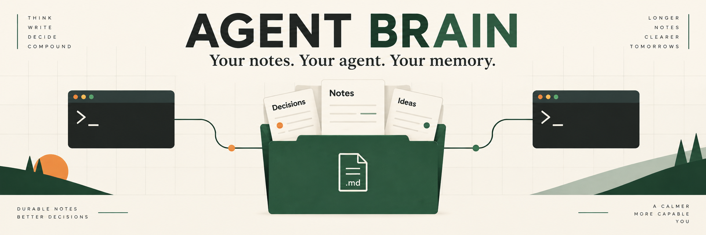
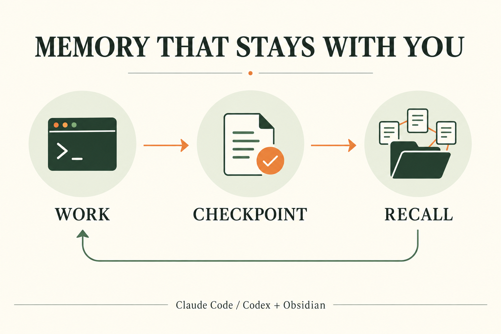

# Agent Brain



Give **Claude Code, Codex, or both** a private Obsidian vault they can maintain
and recall across sessions. One public setup with only the skills and tools
needed for the Brain workflow. Your notes stay on your computer.

## Install

Have **Obsidian** and **Python 3.11+** installed. Claude's hooks also need
**Node.js 22+**. Guided setup checks these, lets you choose a CLI and vault
folder, and offers the official installer if your chosen CLI is missing.
You do not need Git, a GitHub account, or another repository.

**macOS / Linux** (Terminal with Bash or Zsh):

```bash
bash <(curl -fsSL https://raw.githubusercontent.com/gabz147/agent-brain/main/bootstrap.sh)
```

**Windows** (PowerShell):

```powershell
& ([scriptblock]::Create((Invoke-RestMethod https://raw.githubusercontent.com/gabz147/agent-brain/main/bootstrap.ps1)))
```

Setup previews its changes and asks before applying them. It configures Brain
paths for your chosen clients, creates the vault, and checks the installed
workflow. Then open the printed folder in Obsidian, restart/sign into your CLI,
and follow [your first checkpoint](FIRST-CHECKPOINT.md).

Missing Python or Node? See [prerequisites and troubleshooting](LAPTOP-SETUP.md).
Prefer to inspect the download first? Use the
[download-and-inspect method](LAPTOP-SETUP.md#download-and-inspect).

## What you get

| Component | Purpose |
|---|---|
| Starter vault | A blank profile, priorities, decisions, project index, daily notes and native Home dashboard |
| Obsidian templates | Configured Daily Notes and Templates on a fresh vault |
| `obsidian-vault` | Retrieve context and maintain notes using shared writing rules |
| `handoff` | Leave a usable continuation point for the next session |
| `source-to-vault` | Turn reviewed source material into traceable notes |
| Startup instructions | Load relevant context on demand; checkpoint substantive work and decisions |
| Shared writer | Validate notes, preserve history, back up changes and return compact verified receipts |
| On-demand actions | Read-only link checks, inbox triage, next actions and evidence freshness |
| Claude hooks, if selected | Remind Claude to checkpoint and validate completed Markdown writes |

No personal skill bundle, unrelated plugins, credentials or prewritten personal
notes are installed. Existing notes and unrelated client settings are preserved.
Client accounts and usage costs remain your own.

## How it works



The agent starts with a compact boot policy. Greetings and self-contained
questions need no vault reads. For substantive project work, it reads the map
and relevant notes. Priorities are for status/continuation, daily history starts
with compact Open/session navigation and relevant complete sessions, and workflow sections load before writing.
Compaction reloads only missing context for the current task.

It saves substantial findings, decisions and handoffs through the shared writer,
then appends a verified daily checkpoint. Future sessions retrieve that context
from the same Markdown files you see in Obsidian.

Claude has a Stop-hook reminder. Codex checkpoints through startup instructions
and skills. This guides agent behavior; the [first-checkpoint check](FIRST-CHECKPOINT.md)
confirms it works with your account, permissions and installed client version.
Brief replies need not become notes.

## Platforms and optional features

The core installer, vault writer and live checkpoints support **Windows, macOS
and Linux**, with Claude-only, Codex-only and combined installations. Your chosen
CLI must also support your OS/version. WSL is a separate Linux installation.

Background retrospective capture is **optional, Windows-only, and not enabled
by setup**. It requires Claude authentication even when capturing Codex sessions,
uses model tokens, and retains idle/fullscreen/pause guards. Live Codex-only use
does not require Claude. See [optional scheduling](automation/README.md).
[Agent Pulse](plugins/agent-pulse/README.md) is an optional Obsidian indicator.

This installs a template, not a cloud sync service. Keep actual notes and runtime
state outside this public repository. Configure your own private backup or
Obsidian Sync separately if wanted.

## Updates and maintenance

Rerun the same setup command to review an update. Differing workflow files need
explicit replacement and get local backups. Existing notes, vault settings,
custom schema, queues and receipts remain intact. Selected clients retain their
configured vault unless you choose a different path.

The updated shared boot block replaces older blanket startup reads, including
those retained in existing vault notes. User-specific instructions outside that
block are preserved; reconcile any separate full-startup requirement manually.
See [context loading and measurement](docs/context-loading.md) for the budget,
upgrade behavior and a reproducible size check.

- [Setup and troubleshooting](LAPTOP-SETUP.md)
- [Advanced installation and upgrades](INSTALL.md)
- [First checkpoint and recall](FIRST-CHECKPOINT.md)
- [Automation reference](automation/README.md)
- [Graphics and prompts](docs/graphics/README.md)

From a reviewed checkout, run `python3 -m unittest discover -s automation/tests -q`
(`python` on Windows). [CI](https://github.com/gabz147/agent-brain/actions) checks
all three OS families using isolated homes, preservation/upgrade tests and
source-bound checkpoint fixtures. Tests do not write your real vault or make
paid model calls. GUI/account acceptance is a separate first-checkpoint step.

[MIT license](LICENSE).
